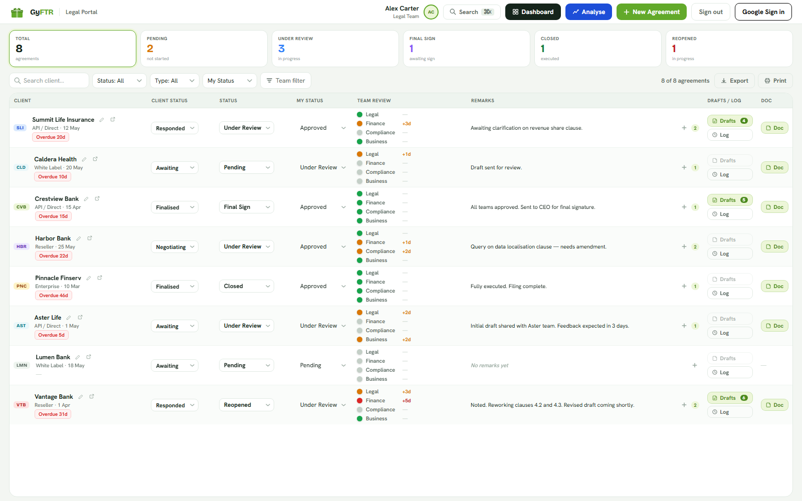

# GyfTR Legal Portal

[](https://github.com/yashtahlyani/gyftr-legal/actions/workflows/ci.yml)
[](LICENSE)
[](https://vitejs.dev/)
[](https://supabase.com/)

Production-ready legal agreement tracking portal built with Vite + Supabase.

A lightweight, framework-free portal for tracking legal agreements, drafts,
remarks, team review status, reminders, and AI-assisted clause analysis.



> Dashboard: per-client agreement tracking with client/internal status,
> multi-team review state, draft counts, remarks, and one-click document access.

## Project Structure

```
gyftr-legal/
├── index.html              # Login page
├── app.html                # Main portal (all screens)
├── vite.config.js
├── package.json
├── .env.local              # YOUR KEYS GO HERE (never commit)
├── src/
│   ├── css/style.css       # All styles
│   ├── lib/supabase.js     # DB client
│   ├── auth/
│   │   ├── login.js        # Sign in / sign out
│   │   └── guard.js        # Auth redirect guard
│   ├── data/
│   │   ├── sample.js       # Demo data (prototype mode)
│   │   ├── agreements.js   # CRUD for agreements
│   │   ├── drafts.js       # File upload + fetch drafts
│   │   ├── remarks.js      # Add / fetch remarks
│   │   ├── team-status.js  # Update team status + history
│   │   ├── reminders.js    # Send / fetch reminders
│   │   └── clauses.js      # AI clause analysis
│   ├── ui/
│   │   ├── utils.js        # fd(), ns(), showToast() etc.
│   │   └── app-logic.js    # Full portal JS (extracted from HTML)
│   ├── login.js            # Entry point → index.html
│   └── main.js             # Entry point → app.html
└── supabase/
    ├── schema.sql          # Run this first in Supabase SQL editor
    └── functions/
        ├── analyse-drafts/ # Claude API clause comparison
        └── sign-document/  # Adobe Sign integration
```

## Setup — Step by Step

### Step 1 — Install dependencies
```bash
npm install
```

### Step 2 — Create .env.local
```
VITE_SUPABASE_URL=https://your-project.supabase.co
VITE_SUPABASE_ANON_KEY=your-anon-key
```
Get these from: Supabase Dashboard → Settings → API

### Step 3 — Run SQL schema
Go to: Supabase Dashboard → SQL Editor → New Query
Paste and run the contents of `supabase/schema.sql`

### Step 4 — Create test users
Go to: Supabase Dashboard → Authentication → Users → Add User

| Email | Password |
|-------|----------|
| alex.carter@example.com | ChangeMe123! |
| jordan.lee@example.com | ChangeMe123! |
| sam.rivera@example.com | ChangeMe123! |
| riley.quinn@example.com | ChangeMe123! |

Then copy each UUID and uncomment + fill the INSERT in schema.sql

### Step 5 — Start dev server
```bash
npm run dev
```
Open http://localhost:5173

### Step 6 — Deploy Edge Functions (when ready)
```bash
npm install -g supabase
supabase login
supabase link --project-ref your-project-ref
supabase functions deploy analyse-drafts
supabase functions deploy sign-document
supabase secrets set CLAUDE_API_KEY=your-key
supabase secrets set ADOBE_CLIENT_ID=your-id
supabase secrets set ADOBE_CLIENT_SECRET=your-secret
```

## Prototype vs Production Mode

**Current state: Prototype**
- Uses hardcoded sample data from `src/data/sample.js`
- Login uses role-picker (no real auth)
- All changes are in-memory only

**To switch to Production:**
1. In `src/main.js` — replace `import { AGs } from './data/sample.js'` with `loadAllAgreements()` from `src/data/agreements.js`
2. In `src/login.js` — replace role-picker with `signIn()` from `src/auth/login.js`
3. Wire each action (addRemark, updateTeamStatus, etc.) to their respective data modules

## APIs Used

| Service | Purpose | Setup |
|---------|---------|-------|
| Supabase | Database + Auth + Storage + Realtime | supabase.com |
| Claude API (Anthropic) | AI clause comparison | console.anthropic.com |
| Adobe Sign API | Legal e-signatures | developer.adobe.com |

## Build for Production
```bash
npm run build
# Output in /dist — deploy to Vercel, Netlify, or any static host
```
