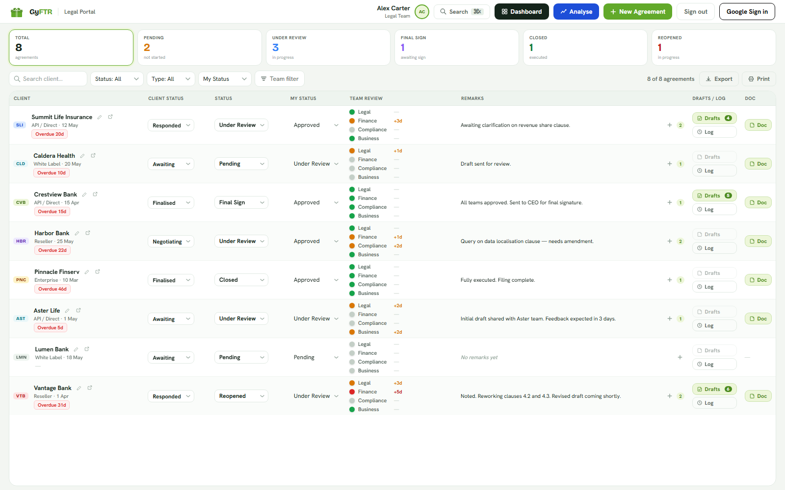

# GyfTR Legal Portal

[](https://github.com/yashtahlyani/gyftr-legal/actions/workflows/ci.yml)
[](LICENSE)
[](https://vitejs.dev/)
[](https://aws.amazon.com/)

Production legal agreement tracking portal — Vite frontend, Express API, self-hosted on AWS.

A lightweight, framework-free portal for tracking legal agreements, drafts,
remarks, team review status, reminders, and AI-assisted clause analysis.



> Dashboard: per-client agreement tracking with client/internal status,
> multi-team review state, draft counts, remarks, and one-click document access.

> **Migration note**: this app originally ran on Vercel + Supabase. It now
> runs on a self-hosted AWS stack (S3 + CloudFront, ALB + EC2, RDS Postgres,
> Cognito). See `infra/HANDOVER.md` for the full architecture and setup
> guide, and `docs/KT.md` for the original feature/screen-level writeup
> (still accurate — only the backend, auth, and hosting changed).

## Project Structure

```
gyftr-legal/
├── index.html              # Login page
├── app.html                # Main portal (all screens)
├── vite.config.js
├── package.json
├── .env.local              # YOUR FRONTEND KEYS GO HERE (never commit)
├── src/
│   ├── css/style.css       # All styles
│   ├── lib/
│   │   ├── api.js          # Backend API client (fetch wrapper)
│   │   └── auth-cognito.js # Cognito login/session
│   ├── data/
│   │   └── sample.js       # Demo data (prototype / demo-mode login)
│   ├── ui/
│   │   ├── utils.js        # fd(), ns(), showToast() etc.
│   │   ├── app-logic.js    # Full portal JS (extracted from HTML)
│   │   ├── google-api.js   # Google Drive/Docs/Picker integration
│   │   └── ai-analyze.js   # AI clause-analysis UI
│   ├── login.js            # Entry point → index.html
│   └── main.js             # Entry point → app.html
├── backend/                 # Express API — see infra/aws-setup.md
│   ├── server.js
│   ├── db.js                # RDS connection (Secrets Manager or env vars)
│   ├── s3.js                 # Draft file storage
│   ├── authz.js               # Authorization rules (was Supabase RLS)
│   ├── middleware/
│   ├── routes/
│   └── schema.sql            # Plain Postgres schema for RDS
├── migration/                # Operational AWS scripts (all support --dry-run)
│   ├── create-cognito-users.js
│   ├── force-password-reset.js
│   ├── migrate-email-domain.js   # not needed: both email domains are accepted
│   └── smoke-test.js
├── infra/
│   ├── aws-setup.md           # Full AWS provisioning guide (first-time)
│   └── HANDOVER.md            # Plain-language overview, logins, cookbook
└── supabase/                  # Old Supabase project files — kept for
    ├── schema.sql              # reference only; no longer deployed.
    └── functions/
```

## Setup — Step by Step

### Step 1 — Install dependencies
```bash
npm install
```

### Step 2 — Create .env.local
```
VITE_API_URL=https://api.your-domain.example
VITE_COGNITO_USER_POOL_ID=ap-south-1_XXXXXXXXX
VITE_COGNITO_CLIENT_ID=your_cognito_client_id
```
Get these from the AWS Cognito console and your backend's ALB/DNS — see
`infra/aws-setup.md` for full provisioning steps if none of this exists yet.

### Step 3 — Provision AWS + set up the database

Follow `infra/aws-setup.md` in order (RDS → Secrets Manager → Cognito → S3
drafts bucket → EC2 → ALB → S3 + CloudFront), then run `backend/schema.sql`
against RDS.

### Step 4 — Migrate or seed users

For a fresh environment, create the 4 team profiles directly in RDS and run
`migration/create-cognito-users.js` to create their Cognito accounts. The
portal does not auto-create profiles: a Cognito user with no `profiles` row
gets a visible "No profile linked to this account" error rather than silently
being given default access.

To deploy a new release, follow **[`DEPLOY.md`](DEPLOY.md)**.

### Step 5 — Start dev server
```bash
npm run dev
```
Open http://localhost:5173. You can also log in without any AWS setup via
the demo-mode role pills on the login screen (Legal/Finance/Business/
Compliance) — this uses local sample data only, no backend required.

### Step 6 — Run the backend locally (optional, for full-stack dev)
```bash
cd backend
npm install
cp .env.example .env   # fill in RDS/Cognito/S3 values
npm run dev
```

## Prototype vs Production Mode

**Demo mode** (role-picker login, no password) still exists for quick demos
— it uses hardcoded sample data from `src/data/sample.js` and never touches
the real database. Logging in with a real `@gyftr.net` email routes through
Cognito and the live backend instead.

## APIs Used

| Service | Purpose | Setup |
|---------|---------|-------|
| AWS Cognito | Authentication | `infra/aws-setup.md` §3 |
| AWS RDS (Postgres) | Database | `infra/aws-setup.md` §1 |
| AWS S3 | Draft file storage + frontend hosting | `infra/aws-setup.md` §4, §7 |
| OpenAI | AI clause risk analysis | platform.openai.com |
| Adobe Sign API | Legal e-signatures | developer.adobe.com |

## Build for Production
```bash
npm run build
# Output in /dist — deploy to S3 + CloudFront, see infra/aws-setup.md §7
```
